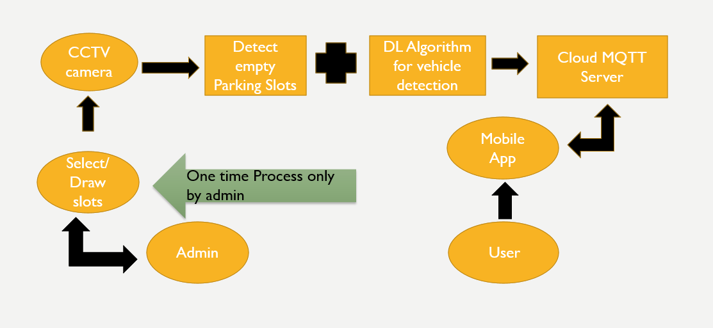
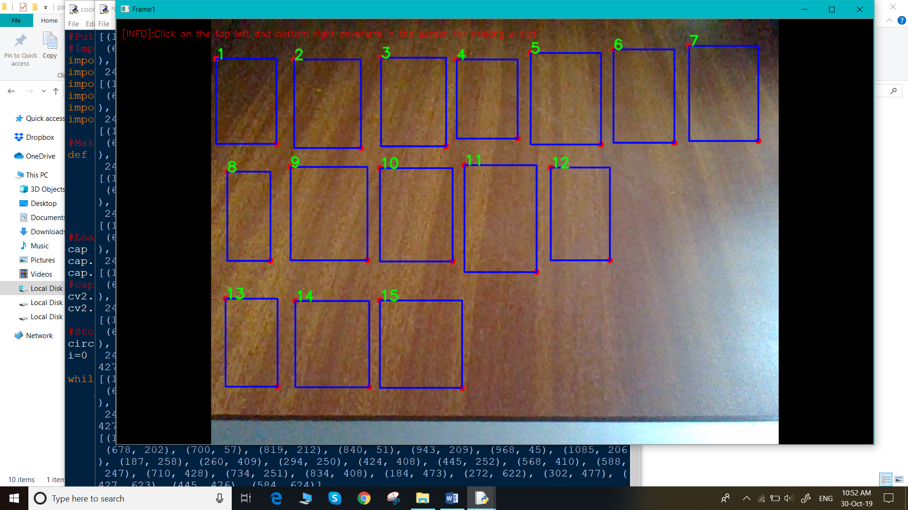
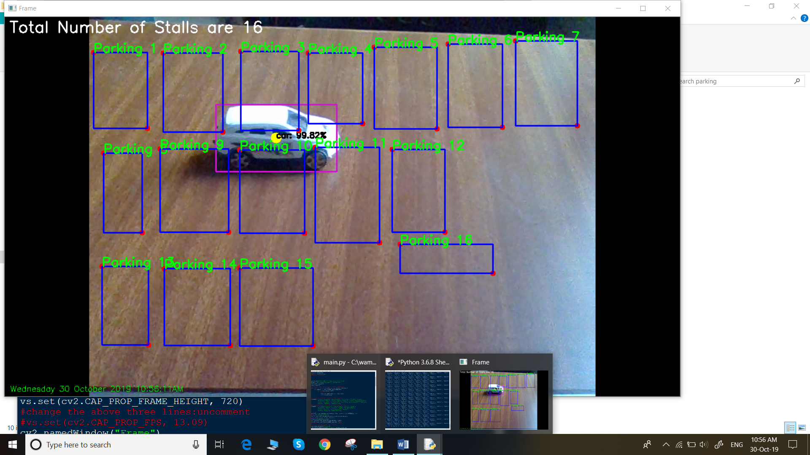
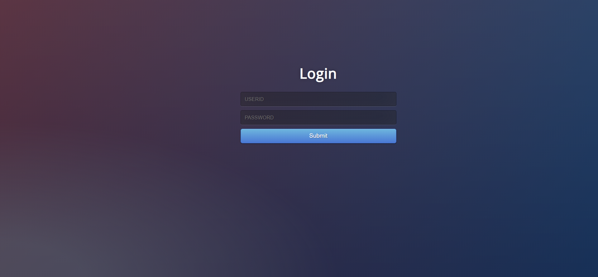
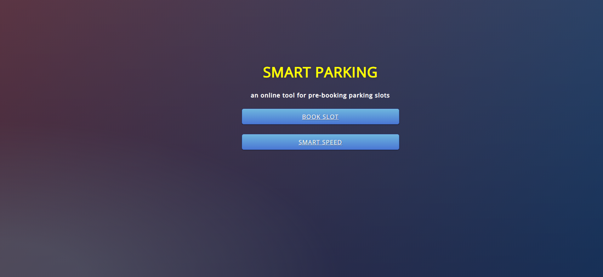
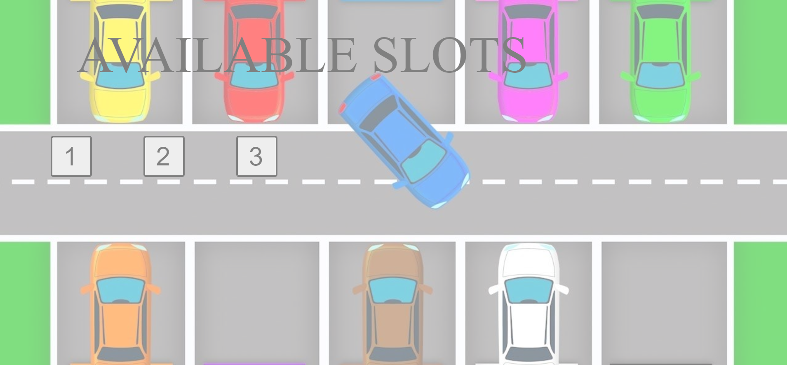
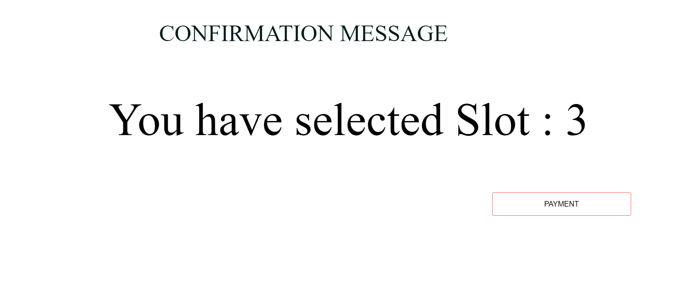
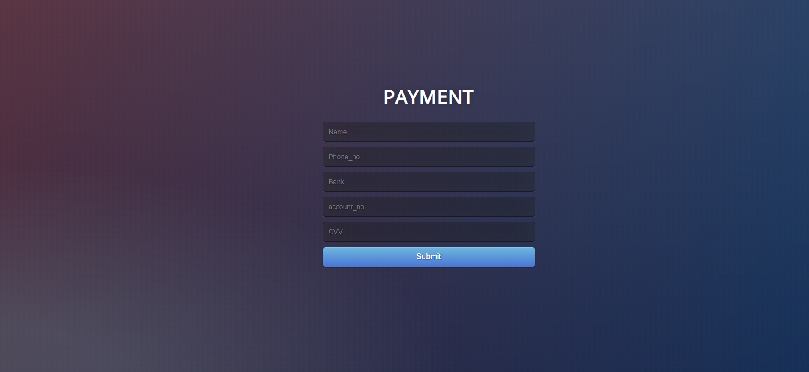

# Smart-Parking-using-Deep-Learning
EasyGo –Smart Parking System is a system that will solve the problem of traffic jam and make lives easy and comfortable. This project will tell the people about the empty slots available for parking before reaching to their destination and hence, can easily park their vehicles to their respective allotted slots. The user have to go to website for login/sign up. After that, user can choose the location by selecting the destination. If the services of EasyGo are available at the destination chosen by the user, then the option of booking slot will come otherwise message will pop out on window, showing no services available. Now, user can book the slots available on the screen by clicking on it. After confirmation, user can pay the money accordingly.
# Approach

•	Part 1: First the camera will detect the empty parking slots / we can also manually allocate the slots and stored their coordinated in file. If we are doing manually then, marking and storing coordinates of parking is one time process as all the coordinates will be stored in file.

•	Part 2: Stored coordinates will be used to determine if the object/vehicle lies inside the marked coordinates ,then that particular slots cannot be used for parking. Detection of vehicle will be done using different deep learning models.

•	Part 3: Empty slots information can be send on the Cloud server where user can get the information about empty slots available.
 

# Algorithm

The general flow of our smart parking system algorithm is fairly straightforward:

1.	First, the admin will create the slots accordingly by using mouse cursor on the screen.

2.	Secondly, the trained/pre-trained model will detect the respective vehicle type like car, bus and motorcycle.

3.	Now we will find the centroid of the bounding box of the vehicle.

4.	If the centroid lies in the empty parking box made by admin. Then, the slot is occupied.

 Run coordinates.py and make slots using mouse click. For making one slot, select top left and bottom right.

 Run main.py for detection of vehicle.[IGNORE: person class ].There are 21 classes, take only relevant classes for dectection.

 Sign Up page

 Login page

 Select parking .[Ignore speed option:still working on]

When other location is selcted

When only VIT chennai is selcted

Availabel slots

Confirmation message

Paymeny option

